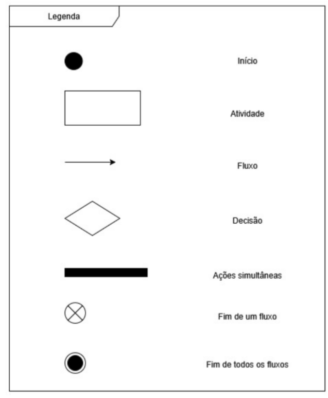
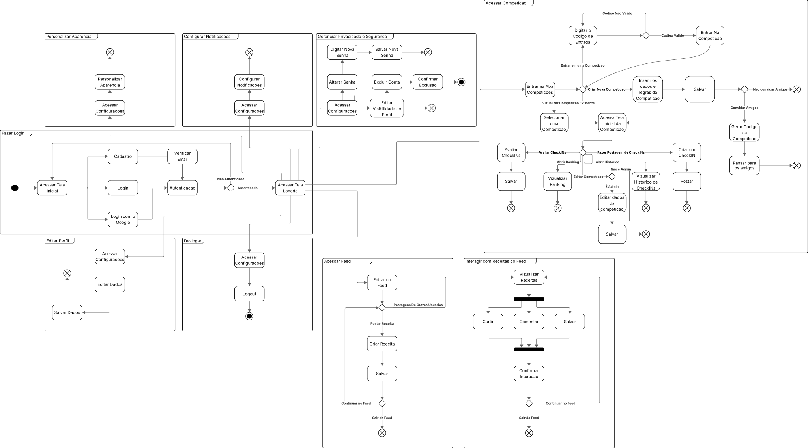
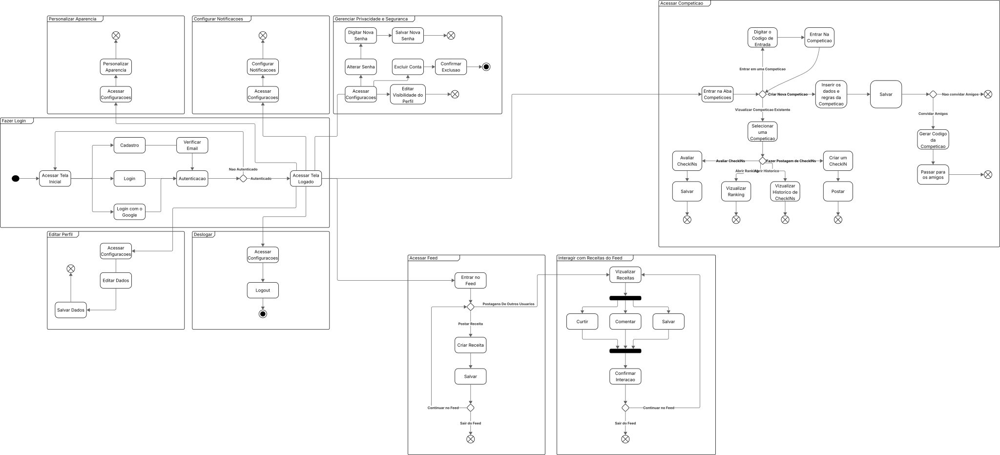

# 2.2.1. Diagrama de Atividades

# Diagrama de Atividades

O diagrama de atividades é um dos diagramas da UML (Unified Modeling Language) utilizado para representar o **fluxo de atividades** em um processo ou sistema. Ele mostra de forma visual como as ações se encadeiam, quais decisões precisam ser tomadas ao longo do processo e como as atividades podem ocorrer de maneira sequencial ou paralela.

A ideia central é representar o **fluxo de controle**, ou seja, como o processo começa, como ele avança por diferentes etapas e como pode terminar. Por isso, é muito usado para modelar casos de uso, fluxos de negócio e até processos internos de software.

Esse tipo de diagrama é bastante útil porque permite que tanto a equipe técnica quanto os usuários ou gestores entendam de forma visual e intuitiva como um processo funciona, facilitando a comunicação e a identificação de melhorias.

---

## Diagrama de Atividades

## Legenda

- **Nó Inicial (● preto)**  
  Representa o ponto de partida do processo. É de onde o fluxo de atividades começa.

- **Atividade (retângulo com cantos arredondados)**  
  Indica uma ação ou tarefa executada dentro do processo.

- **Decisão (losango)**  
  Representa um ponto de escolha no fluxo, onde, de acordo com uma condição, o processo segue por caminhos diferentes.

- **Fluxo de Controle (seta)**  
  Conecta as atividades e elementos, indicando a sequência em que elas ocorrem.

- **Nó Final (círculo com outro círculo ao redor)**  
  Representa o término do processo ou fluxo modelado.

- **Fork (barra preta horizontal/vertical)**  
  Divide o fluxo em atividades paralelas, que podem acontecer ao mesmo tempo.

- **Join (barra preta horizontal/vertical)**  
  Sincroniza fluxos paralelos em um único caminho de execução.

### Diagrama de Atividades V1

<b>Autor(es):</b> 
<a href="https://github.com/SAnjos3" target="_blank">Gabriel Soares dos Anjos</a>, 
<a href="https://github.com/JoaoPedro2206" target="_blank">João Pedro Ferreira Moraes</a>, 
<a href="https://github.com/JoseViniciusQueiroz" target="_blank">Jose Vinicius Alvares Soares de Queiroz</a>,
<a href="https://github.com/leohssjr" target="_blank">Leonardo Henrique Sobral Sauma Junior</a>. 2025
 Link Artefato: <a href="https://lucid.app/lucidchart/6fc6faf3-b80e-46f6-913b-2d2153b66e9b/edit?viewport_loc=-1206%2C436%2C4071%2C1679%2C0_0&invitationId=inv_5a2d8466-b842-46d5-a0e9-84d2263b7fce" target="_blank">LucidChart</a>

### Diagrama de Atividades V2

<b>Autor(es):</b> 
<a href="https://github.com/SAnjos3" target="_blank">Gabriel Soares dos Anjos</a>, 
<a href="https://github.com/JoaoPedro2206" target="_blank">João Pedro Ferreira Moraes</a>, 
<a href="https://github.com/JoseViniciusQueiroz" target="_blank">Jose Vinicius Alvares Soares de Queiroz</a>,
<a href="https://github.com/leohssjr" target="_blank">Leonardo Henrique Sobral Sauma Junior</a>. 2025
 Link Artefato: <a href="https://lucid.app/lucidchart/6fc6faf3-b80e-46f6-913b-2d2153b66e9b/edit?viewport_loc=-1206%2C436%2C4071%2C1679%2C0_0&invitationId=inv_5a2d8466-b842-46d5-a0e9-84d2263b7fce" target="_blank">LucidChart</a>

## Reuniões

### Reunião 1

<<iframe width="560" height="315" src="https://www.youtube.com/embed/DURqx4lvoqI?si=t-oVQ8PNNqzKfwSi" title="YouTube video player" frameborder="0" allow="accelerometer; autoplay; clipboard-write; encrypted-media; gyroscope; picture-in-picture; web-share" referrerpolicy="strict-origin-when-cross-origin" allowfullscreen></iframe>

<b>Participante(s):</b> 
<a href="https://github.com/SAnjos3" target="_blank">Gabriel Soares dos Anjos</a>, 
<a href="https://github.com/JoaoPedro2206" target="_blank">João Pedro Ferreira Moraes</a>, 
<a href="https://github.com/JoseViniciusQueiroz" target="_blank">Jose Vinicius Alvares Soares de Queiroz</a>,
<a href="https://github.com/leohssjr" target="_blank">Leonardo Henrique Sobral Sauma Junior</a>. 2025

## Referências Bibliográficas

> BÓSON TREINAMENTOS. O que é um Diagrama de Atividade UML - Introdução. [S. l.], 2022. 1 vídeo (13 min e 48 s). Disponível em: https://www.youtube.com/watch?v=_1vHj_j3zDY. Acesso em: 17 set. 2025.

> LUCID SOFTWARE PORTUGUÊS. Tutorial de Diagramas de Classes UML. [S. l.], 2018. 1 vídeo (11 min e 32 s). Disponível em: https://www.youtube.com/watch?v=rDidOn6KN9k. Acesso em: 16 set. 2025.

> SERRANO, Milene. Arquitetura e Desenho de Software: DSW-Modelagem - Diagrama de Atividade. Videoaula, curso de Engenharia de Software, Universidade de Brasília, 2025. Acessado em: 19 set. 2025.

## Histórico de Versão
| Data       | Versão | Descrição                                                                 | Autor                                                                                 | Revisores |
| ---------- | ------ | ------------------------------------------------------------------------- | ------------------------------------------------------------------------------------- | --------- |
| 17/09/2025 | `1.0`  | Criação inicial do documento e elaboração dos tópicos. | [Leonardo Sauma](https://github.com/leohssjr) |[Gabriel Soares](https://github.com/SAnjos3), [João Pedro Moraes](https://github.com/JoaoPedro2206) |
| 16/09/2025 | `2.0`  | Adição do Diagrama de Atividades Versão 1. | [João Pedro Moraes](https://github.com/JoaoPedro2206) | [Gabriel Soares](https://github.com/SAnjos3), [José Vinicius](https://github.com/JoseViniciusQueiroz),[Leonardo Sauma](https://github.com/leohssjr)|
| 17/09/2025 | `2.1`  | Adição do Diagrama de Atividades Versão 2. | [Gabriel Soares](https://github.com/SAnjos3), [João Pedro Moraes](https://github.com/JoaoPedro2206), [José Vinicius](https://github.com/JoseViniciusQueiroz), [Leonardo Sauma](https://github.com/leohssjr) |  |
| 17/09/2025 | `3.0`  | Finalização do documento e adição das referências bibliográficas | [Gabriel Soares](https://github.com/SAnjos3), [João Pedro Moraes](https://github.com/JoaoPedro2206), [José Vinicius](https://github.com/JoseViniciusQueiroz), [Leonardo Sauma](https://github.com/leohssjr) |  |