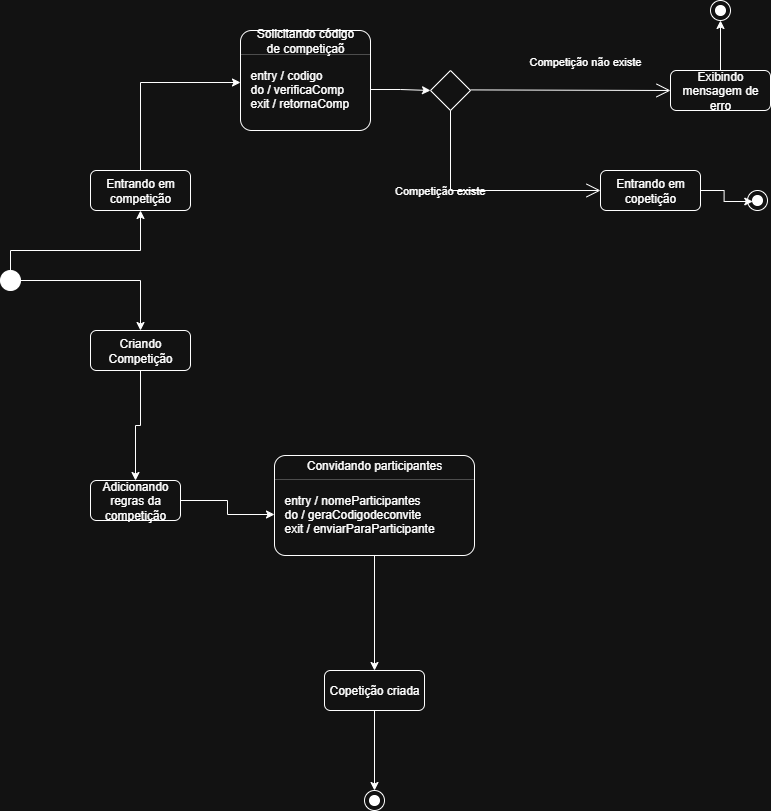

# 2.2.2. Diagrama de Estados

## Introdução
O diagrama de estados é uma ferramenta da engenharia de software utilizada para representar o comportamento dinâmico de um sistema, funcionalidade ou objeto ao longo do tempo. Ele descreve os diferentes estados que podem ser assumidos, os eventos que provocam mudanças (transições) e as ações associadas a essas mudanças. É útil para compreender como o sistema reage a interações e condições específicas.'

## Metodologia
Para a criação dos diagramas, utilizamos a notação UML (Unified Modeling Language) como base. A ferramenta escolhida foi **DRAW IO**, que possibilitou a modelagem visual de estados e transições, garantindo clareza e organização.  
A equipe optou por representar **a função de login, a função de criar uma competição e a postagem de receitas**, destacando pontos de decisão, validações e fluxos alternativos.

## Diagramas

### Figura 1: Diagrama de estado – [Diagrama de criação de competição]

**Autor(es): [NOME(S)]**

---

### Figura 2: Diagrama de estado – [NOME DA FUNCIONALIDADE 2]

**Autor(es): [NOME(S)]**

---

### Figura 3: Diagrama de estado – [Diagrama do Feed de receita]

<iframe frameborder="0" style="width:100%;height:796px;" src="https://viewer.diagrams.net/?tags=%7B%7D&lightbox=1&highlight=0000ff&layers=1&nav=1&title=Diagrama%20de%20Estados&transparent=1&dark=auto#Uhttps%3A%2F%2Fdrive.google.com%2Fuc%3Fid%3D1p7SOrcTEXQo63Kdz7WhGv7_s65_gY6I0%26export%3Ddownload" allowtransparency="true"></iframe>

<b>Autor(es):</b> 
<a href="https://github.com/Yagoas" target="_blank">Yago Amin Santos</a>, 

---

## Análise e Resultados

### [Funcionalidade 1]
- Descreva o fluxo principal de estados e transições.  
- Destaque pontos de validação (dados válidos/inválidos, exceções, etc.).  
- Comente sobre clareza do fluxo, melhorias identificadas ou impacto na experiência do usuário.  

### [Funcionalidade 2]
- Explique o comportamento do sistema para essa funcionalidade.  
- Mostre como o diagrama ajudou a identificar gargalos, dependências ou pontos críticos.  

### [Funcionalidade 3]
- Relate como os estados se encadeiam e qual o estado final esperado.  
- Comente feedbacks da equipe sobre o modelo.  

---

## Tabela de Participação na Produção do Artefato

| Nome do Integrante | Artefato | Descrição da Contribuição | Análise Crítica* | Link Comprobatório |
|---------------------|----------|---------------------------|------------------|---------------------|
| [Nome 1] | Diagrama de Estados | [Descrição] | [Análise crítica] | [Ata / Link] |
| [Nome 2] | Diagrama de Estados | [Descrição] | [Análise crítica] | [Ata / Link] |
| ... | ... | ... | ... | ... |

---

## Referências Bibliográficas
- BÓSON TREINAMENTOS. Introdução ao Diagrama de Máquina de Estados UML. YouTube, 9 mar. 2024. Disponível em: https://www.youtube.com/watch?v=N0wc9sHp5yo
. Acesso em: 21 set. 2025.
- SERRANO, Milene. VideoAula - DSW - Modelagem - Diagrama de Estados. Disponível em: https://unbbr-my.sharepoint.com/:v:/g/personal/mileneserrano_unb_br/EVt5jx7bvt5EiqelJvctOWABgPN99blmzDIkQCFGxZ2Rbw?e=rndOlR. Acesso em: 21 set. 2025.

---

## Histórico de Versões

| Versão | Data | Descrição | Autor(es) | Revisor(es) |
|--------|------|-----------|------------|--------------|
| 1.0 | 21/09/2025 | Criação do Documento | [Filipe Bressanelli Azevedo Filho](https://github.com/fbressa) | [Revisor(es)] |
| 1.1 | 21/09/2025 | Adiciona referência bibliográfica | [Filipe Bressanelli Azevedo Filho](https://github.com/fbressa) | [Revisor(es)] |
| 1.2 | 21/09/2025 | Adiciona diagrama 1 | [Filipe Bressanelli Azevedo Filho](https://github.com/fbressa) | [Yago Amin Santos](https://github.com/yagoas) |
| 1.3 | 21/09/2025 | Adiciona diagrama 3 | [Yago Amin Santos](https://github.com/yagoas) | [Revisor(es)] |
