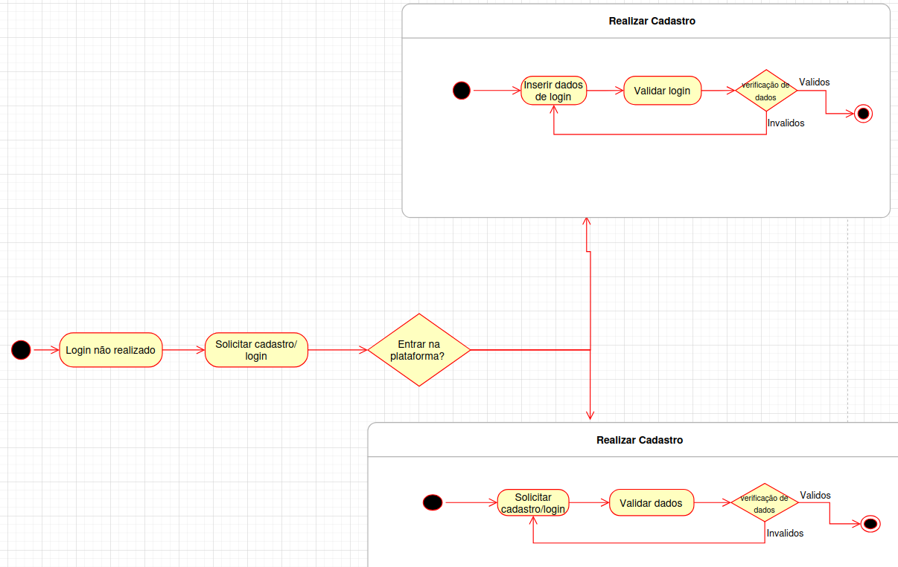

# 2.2.2. Diagrama de Estados

## Introdução
O diagrama de estados é uma ferramenta da engenharia de software utilizada para representar o comportamento dinâmico de um sistema, funcionalidade ou objeto ao longo do tempo. Ele descreve os diferentes estados que podem ser assumidos, os eventos que provocam mudanças (transições) e as ações associadas a essas mudanças. É útil para compreender como o sistema reage a interações e condições específicas.'

## Metodologia
Para a criação dos diagramas, utilizamos a notação UML (Unified Modeling Language) como base. A ferramenta escolhida foi **DRAW IO**, que possibilitou a modelagem visual de estados e transições, garantindo clareza e organização.  
A equipe optou por representar **a função de login, a função de criar uma competição e a postagem de receitas**, destacando pontos de decisão, validações e fluxos alternativos.

## Diagramas

### Figura 1: Diagrama de estado – [Diagrama de criação de competição]

<b>Autor(es):</b> 
<a href="https://github.com/fbressa" target="_blank">ilipe Bressanelli Azevedo Filho</a>, 

---

### Figura 2: Diagrama de estado – [Diagrama Login/Cadastro]

<b>Autor(es):</b> 
<a href="https://github.com/eduardoferre" target="_blank">Eduardo Ferreira</a>, 

---

### Figura 3: Diagrama de estado – [Diagrama do Feed de receita]

<iframe frameborder="0" style="width:100%;height:796px;" src="https://viewer.diagrams.net/?tags=%7B%7D&lightbox=1&highlight=0000ff&layers=1&nav=1&title=Diagrama%20de%20Estados&transparent=1&dark=auto#Uhttps%3A%2F%2Fdrive.google.com%2Fuc%3Fid%3D1p7SOrcTEXQo63Kdz7WhGv7_s65_gY6I0%26export%3Ddownload" allowtransparency="true"></iframe>

<b>Autor(es):</b> 
<a href="https://github.com/Yagoas" target="_blank">Yago Amin Santos</a>, 

---

## Análise e Resultados
### Figura 1 : Diagrama de criação de competição
O fluxo descreve o comportamento do sistema quando um usuário deseja entrar em uma competição existente ou criar uma nova.

Inicialmente, o usuário está no estado de Solicitação de código de competição. Nesse momento, o sistema pede o código e executa a verificação de validade. Se a competição não existir, o sistema redireciona para o estado Exibindo mensagem de erro, encerrando a ação. Caso a competição exista, o usuário é direcionado para o estado Entrando em competição, finalizando o processo de acesso.

Alternativamente, se o usuário optar por criar uma competição, o sistema passa para o estado Criando Competição. Em seguida, o usuário pode configurar o sistema no estado Adicionando regras da competição, definindo os parâmetros necessários. Após essa etapa, o sistema entra no estado Convidando participantes, onde nomes de participantes são fornecidos, um código de convite é gerado e enviado. Quando essa etapa é concluída, a competição é marcada como Competição criada.

Assim, o sistema garante que o usuário possa tanto ingressar em uma competição existente (validando o código fornecido) quanto criar uma nova (definindo regras e participantes antes da finalização).

### Figura 2 : Diagrama Login/Cadastro
O fluxo descreve o comportamento do sistema quando o usuário tenta acessar a plataforma, mas ainda não está autenticado.

O processo se inicia no estado Login não realizado, onde o usuário não possui uma sessão ativa. Em seguida, o sistema direciona para o estado Solicitar cadastro/login, apresentando as opções de inserir credenciais já existentes ou criar uma nova conta.

Nesse ponto, há uma decisão: “Entrar na plataforma?”. Se o usuário optar por acessar com uma conta já existente, o sistema segue para o subfluxo Realizar Login. Nele, o usuário passa pelo estado Inserir dados de login, fornecendo suas credenciais. O sistema então avança para Validar login, onde ocorre a verificação dos dados. Caso os dados sejam válidos, o processo é concluído com sucesso e o usuário é autenticado. Porém, se os dados forem inválidos, o fluxo retorna ao estado de inserção de login, permitindo nova tentativa.

Se o usuário optar por criar uma nova conta, o sistema segue para o subfluxo Realizar Cadastro. Nele, o primeiro passo é o estado Solicitar cadastro/login, no qual o usuário fornece informações necessárias para registro. Em seguida, ocorre o estado Validar dados, onde o sistema verifica consistência e requisitos das informações fornecidas. Caso os dados sejam válidos, o cadastro é finalizado com sucesso e o usuário pode acessar a plataforma. Se os dados forem inválidos, o sistema retorna para o estado inicial de solicitação, aguardando correção e novo envio.

Esse fluxo garante que apenas usuários devidamente autenticados ou cadastrados consigam acessar a plataforma, oferecendo retorno imediato em casos de erro e possibilidade de repetir a operação.

### Figura 3 : Diagrama do Feed de receita

O fluxo descreve o comportamento do sistema quando o usuário interage com o feed de receitas.

O processo começa no estado Carregando Receitas, onde o sistema consulta a API, exibe um indicador de carregamento (spinner) e aguarda resposta por até 3 segundos. A partir daí, três cenários podem ocorrer:
- Em caso de falha ou timeout, o usuário é redirecionado para o estado Erro Carregamento, onde é exibida uma mensagem de erro e oferecida a opção de tentar novamente ou sair.
- Se a lista de receitas estiver vazia, o sistema entra no estado Feed Vazio, exibindo a mensagem “Nenhuma receita encontrada” e oferecendo a possibilidade de publicar uma nova receita.
- Se receitas estiverem disponíveis, o feed é carregado e o sistema passa para o estado Feed Carregado.

Dentro do Feed Carregado, o usuário pode rolar as receitas (estado Rolando Feed), visualizar informações resumidas (Visualizando Receita) e, a partir daí, interagir de diferentes formas:
- Curtir/Descurtir, alterando o contador de curtidas (Curtida Registrada).
- Salvar Receita, que adiciona a receita à lista pessoal (Receita Salva).
- Comentar, registrando no banco de dados e atualizando a lista de comentários (Comentário Adicionado).
- Ou ainda clicar em “Ver mais”, para visualizar o Detalhes da Receita, retornando ao feed ao finalizar.

O ciclo permanece ativo enquanto o usuário interage com o feed, e pode ser encerrado a qualquer momento se ele sair. 

## Referências Bibliográficas

> BÓSON TREINAMENTOS. Introdução ao Diagrama de Máquina de Estados UML. YouTube, 9 mar. 2024. [Acessado em: 21 set. 2025.](https://www.youtube.com/watch?v=N0wc9sHp5yo) 

> SERRANO, Milene. VideoAula - DSW - Modelagem - Diagrama de Estados. [Acessado em: 21 set. 2025.](https://unbbr-my.sharepoint.com/:v:/g/personal/mileneserrano_unb_br/EVt5jx7bvt5EiqelJvctOWABgPN99blmzDIkQCFGxZ2Rbw?e=rndOlR) 

---

## Histórico de Versões

| Versão | Data | Descrição | Autor(es) | Revisor(es) |
|--------|------|-----------|------------|--------------|
| `1.0`  | 21/09/2025 | Criação do Documento | [Filipe Bressanelli Azevedo Filho](https://github.com/fbressa) | [Eduardo Ferreira](https://github.com/eduardoferre) |
| `1.1`  | 21/09/2025 | Adiciona referência bibliográfica | [Filipe Bressanelli Azevedo Filho](https://github.com/fbressa) | [Eduardo Ferreira](https://github.com/eduardoferre) |
| `1.2`  | 21/09/2025 | Adiciona diagrama 1 | [Filipe Bressanelli Azevedo Filho](https://github.com/fbressa) | [Yago Amin Santos](https://github.com/yagoas) |
| `1.3`  | 21/09/2025 | Adiciona diagrama 3 | [Yago Amin Santos](https://github.com/yagoas) | [Eduardo Ferreira](https://github.com/eduardoferre) |
| `1.4`  | 21/09/2025 | Adiciona diagrama 2 e descrição das funcionalidades | [Eduardo Ferreira](https://github.com/eduardoferre) |  |
