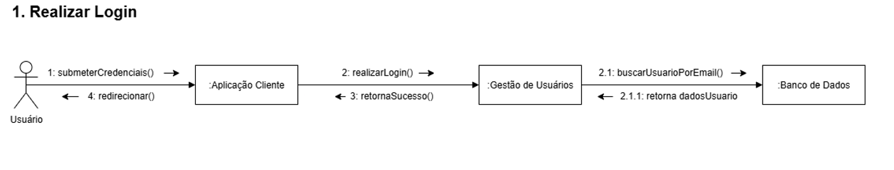
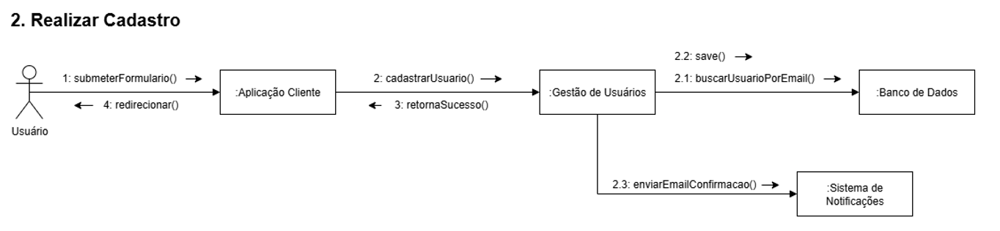
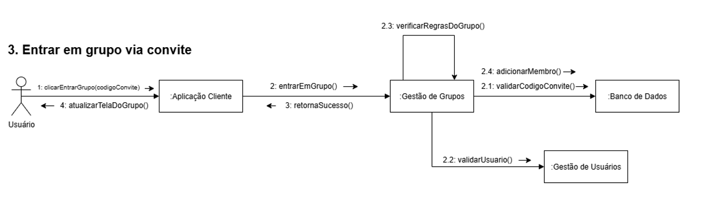
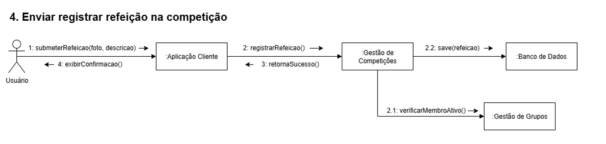
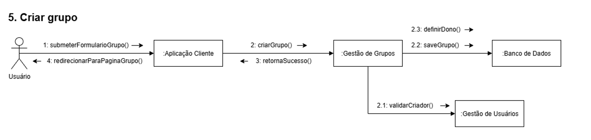
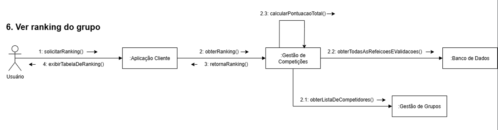
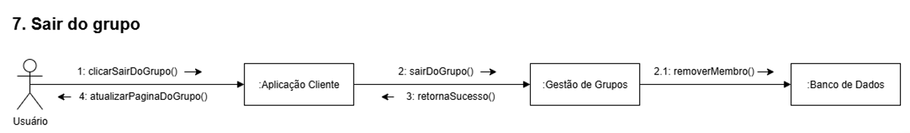
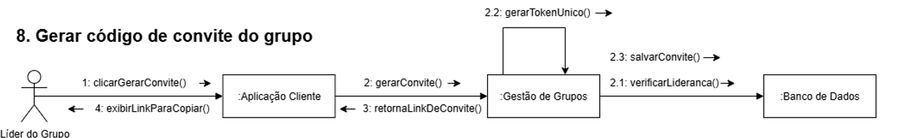
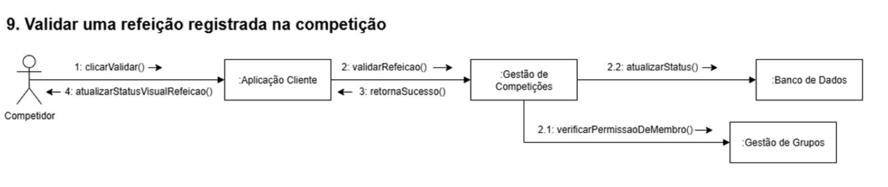

# 2.2.3. Diagrama de Colaboração

## Introdução
**O diagrama de colaboração**, também chamado de diagrama de comunicação, é um aspecto fundamental da UML e fornece uma representação visual abrangente de como os objetos em um sistema interagem e se relacionam entre si. É mais do que apenas uma imagem estática; é um mapa dinâmico que ilustra a complexa rede de comunicações dentro de um sistema, destacando como cada componente contribui de forma colaborativa para a funcionalidade abrangente.

## Metodologia
Para a criação do **diagrama de colaboração**, utilizamos a notação **UML (Unified Modeling Language)** como base, com ênfase nos conceitos de colaboração entre objetos para representar interações e responsabilidades. A ferramenta escolhida para modelagem foi **DRAW IO**, que permitiu desenhar visualmente os objetos, suas associações, e a ordem dessas interações, mantendo clareza e organização.

A equipe definiu as funcionalidades mais importantes para serem representadas no diagrama de colaboração. Em cada função, identificamos atores e os [componentes](../ModelagemEstatica/2.1.2.DiagramaDeComponentes.md) envolvidos, destacando fluxos e interações necessárias entre eles.

## Diagramas de Colaboração

### Diagrama 1: 

<b>Autor(es):</b> 
<a href="https://github.com/MylenaTrindade" target="_blank">Mylena Trindade Mendonça</a>

### Diagrama 2: 

<b>Autor(es):</b> 
<a href="https://github.com/MylenaTrindade" target="_blank">Mylena Trindade Mendonça</a>

### Diagrama 3: 

<b>Autor(es):</b> 
<a href="https://github.com/MylenaTrindade" target="_blank">Mylena Trindade Mendonça</a>

### Diagrama 4: 

<b>Autor(es):</b> 
<a href="https://github.com/marcomarquesdc" target="_blank">Marco Marques</a>

### Diagrama 5: 

<b>Autor(es):</b> 
<a href="https://github.com/marcomarquesdc" target="_blank">Marco Marques</a>

### Diagrama 6: 

<b>Autor(es):</b> 
<a href="https://github.com/marcomarquesdc" target="_blank">Marco Marques</a>

### Diagrama 7: 

<b>Autor(es):</b> 
<a href="https://github.com/Arturhk05" target="_blank">Artur Handow Krauspenhar</a> 

### Diagrama 8: 

<b>Autor(es):</b> 
<a href="https://github.com/Arturhk05" target="_blank">Artur Handow Krauspenhar</a> 

### Diagrama 9: 

<b>Autor(es):</b> 
<a href="https://github.com/Arturhk05" target="_blank">Artur Handow Krauspenhar</a> 

## Principais elementos representados do Diagramas de Colaboração UML  

Os diagramas de colaboração da UML utilizam diferentes elementos para representar como objetos interagem dentro de um sistema. Esses elementos ajudam a compreender melhor o fluxo de comunicação, as responsabilidades e o comportamento dos componentes.  

- **Objetos**: principais componentes do diagrama, representam entidades, classes ou componentes do sistema.  
- **Links**: linhas que conectam objetos, indicando relacionamento ou interação.  
- **Mensagens**: setas rotuladas que mostram a comunicação entre objetos.  
- **Números de sequência**: indicam a ordem do fluxo das mensagens.  

## Referência Bibliográficas  

> Miro. Diagrama de Colaboração UML: o que é? Exemplos e modelos editáveis. [Acessado em: 21 set. 2025.](https://miro.com/pt/diagrama/o-que-e-diagrama-colaboracao-uml/) 

> IBM. Diagramas de Colaboração BPMN. IBM Rational Software Architect 9.6.1. [Acessado em: 21 set. 2025.](https://www.ibm.com/docs/pt-br/rational-soft-arch/9.6.1?topic=diagrams-bpmn-collaboration) 

## Histórico de Versões

| Versão | Data | Descrição | Autor(es) | Revisor(es) |
|--------|------|-----------|------------|--------------|
| `1.0` | 21/09/2025 | Criação do Documento | [Mylena Trindade de Mendoça](https://github.com/MylenaTrindade) | [Artur Krauspenhar](https://github.com/Arturhk05) |
| `2.0` | 21/09/2025 | Adiciona Diagramas  | [Artur Krauspenhar](https://github.com/Arturhk05) | |