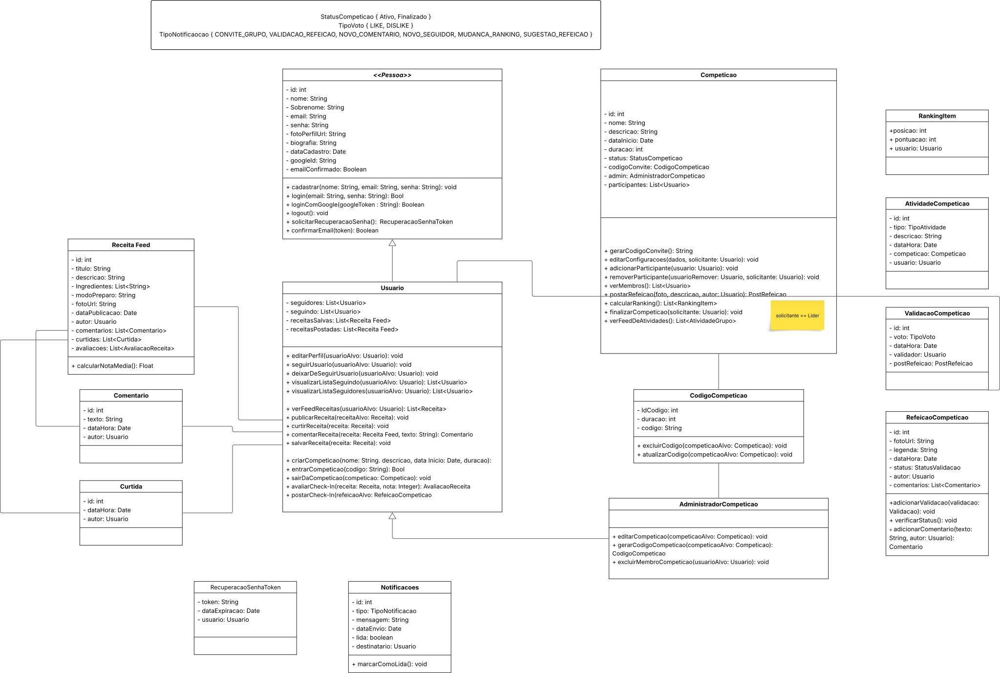
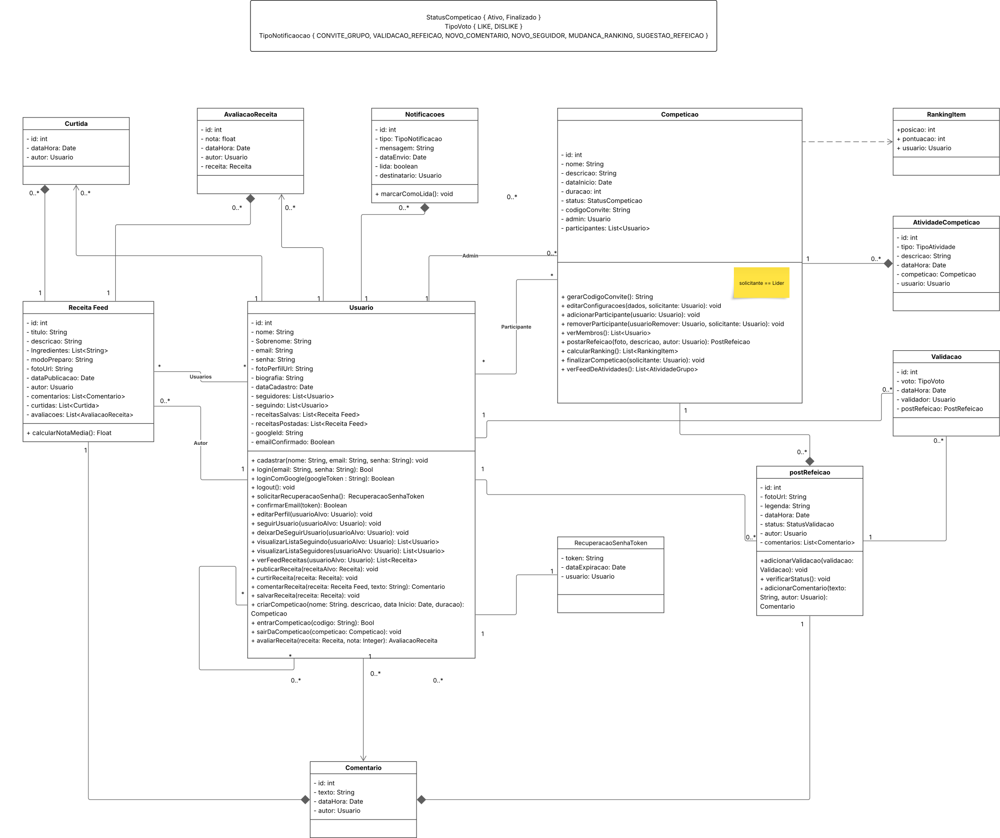
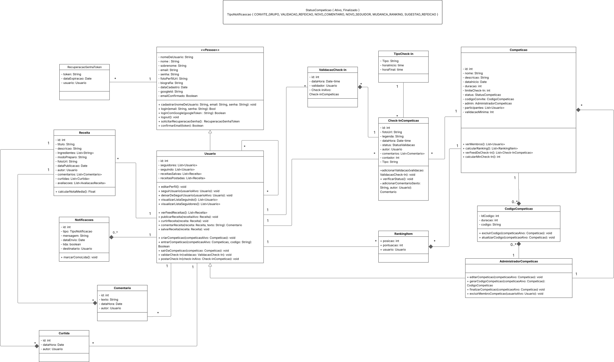

# 2.1.1 Diagrama de Classes - Modelagem Estática

## Introdução

&nbsp;&nbsp;&nbsp;&nbsp;A modelagem de classes é uma etapa essencial no processo de desenvolvimento de sistemas orientados a objetos, pois permite representar, de forma estruturada e estática, os elementos principais de um sistema, suas características e relacionamentos. 

&nbsp;&nbsp;&nbsp;&nbsp;Por meio do diagrama de classes, é possível visualizar abstrações do mundo real em termos de entidades, atributos e comportamentos, além de compreender como essas entidades interagem entre si. Entre os principais relacionamentos representados nesse tipo de diagrama, destacam-se:

- **Associação**: conexão direta entre duas ou mais classes que colaboram entre si.

- **Agregação**: vínculo do tipo "todo-parte", em que o todo é composto de partes que podem existir de forma independente.

- **Composição**: forma mais restritiva da agregação, em que o ciclo de vida das partes depende do todo.

- **Generalização** (Herança): mecanismo que permite o reaproveitamento de atributos e métodos entre classes de diferentes níveis hierárquicos.

- **Dependência**: relação mais fraca, em que uma classe utiliza temporariamente outra, geralmente em um método.

## Objetivo

&nbsp;&nbsp;&nbsp;&nbsp;O objetivo desta modelagem é representar graficamente a estrutura do sistema em desenvolvimento. Essa representação busca garantir clareza na comunicação entre os membros da equipe, apoiar o entendimento dos requisitos e facilitar a implementação posterior do sistema, assegurando consistência e padronização durante o processo de desenvolvimento.

## Metodologia

&nbsp;&nbsp;&nbsp;&nbsp;A metodologia adotada para a construção do diagrama de classes baseia-se nos princípios da UML (Unified Modeling Language), uma linguagem padrão para modelagem de sistemas orientados a objetos. 

&nbsp;&nbsp;&nbsp;&nbsp;Inicialmente, foram levantados os requisitos do sistema, que foram analisados e traduzidos em potenciais classes e relacionamentos. Em complemento, analisou-se o protótipo elaborado pela equipe, para estruturar de formar mais sólida a modelagem do diagrama de classes.

&nbsp;&nbsp;&nbsp;&nbsp;Em seguida, definiu-se a estrutura das classes, com seus atributos e métodos, e os tipos de relacionamentos necessários (associação, herança, agregação ou composição). Por fim, o diagrama foi elaborado utilizando ferramenta lucidchart, permitindo a visualização clara e padronizada da arquitetura do sistema.

## Diagrama de Classes

### Diagrama de Classes V1

Autor(es): Gabriel Soares dos Anjos, João Pedro Ferreira Moraes, Jose Vinicius Alvares Soares de Queiroz, Leonardo Henrique Sobral Sauma Junior ->
[LucidChart](https://lucid.app/lucidchart/4e905228-2fd1-46e6-a4e9-990fc592787d/edit?viewport_loc=-4615%2C5275%2C7703%2C3729%2C0_0&invitationId=inv_19f1da79-c2c4-4c70-8faa-94620e63a5c8)

 

### Diagrama de Classes V2

Autor(es): Gabriel Soares dos Anjos, João Pedro Ferreira Moraes, Jose Vinicius Alvares Soares de Queiroz, Leonardo Henrique Sobral Sauma Junior -> [Reuniao-1](https://youtu.be/FftYFdjNwuE),
[LucidChart](https://lucid.app/lucidchart/4e905228-2fd1-46e6-a4e9-990fc592787d/edit?viewport_loc=-4615%2C5275%2C7703%2C3729%2C0_0&invitationId=inv_19f1da79-c2c4-4c70-8faa-94620e63a5c8)

### Diagrama de Classes V3

Autor(es): Gabriel Soares dos Anjos, João Pedro Ferreira Moraes, Jose Vinicius Alvares Soares de Queiroz, Leonardo Henrique Sobral Sauma Junior -> [Reuniao-2](https://youtu.be/k0ZIonYHGW8),
[LucidChart](https://lucid.app/lucidchart/4e905228-2fd1-46e6-a4e9-990fc592787d/edit?viewport_loc=-4615%2C5275%2C7703%2C3729%2C0_0&invitationId=inv_19f1da79-c2c4-4c70-8faa-94620e63a5c8)

## Reuniões

### Reunião 1

<iframe width="1321" height="743" src="https://www.youtube.com/embed/FftYFdjNwuE" title="Gravação de Reunião - Diagrama de classes - parte I" frameborder="0" allow="accelerometer; autoplay; clipboard-write; encrypted-media; gyroscope; picture-in-picture; web-share" referrerpolicy="strict-origin-when-cross-origin" allowfullscreen></iframe>

Participante(es): Gabriel Soares dos Anjos, João Pedro Ferreira Moraes, Jose Vinicius Alvares Soares de Queiroz, Leonardo Henrique Sobral Sauma Junior

### Reunião 2

<iframe width="1317" height="743" src="https://www.youtube.com/embed/k0ZIonYHGW8" title="Gravação de Reunião - Diagrama de classes - parte II" frameborder="0" allow="accelerometer; autoplay; clipboard-write; encrypted-media; gyroscope; picture-in-picture; web-share" referrerpolicy="strict-origin-when-cross-origin" allowfullscreen></iframe>

Participante(es): Gabriel Soares dos Anjos, Jose Vinicius Alvares Soares de Queiroz

## Bibliografia

[1] BÓSON TREINAMENTOS. O que é um Diagrama de Atividade UML - Introdução. [S. l.], 2022. 1 vídeo (13 min e 48 s).[Acesso](https://www.youtube.com/watch?v=_1vHj_j3zDY). Acesso em: 17 set. 2025.

[2] LUCID SOFTWARE PORTUGUÊS. Tutorial de Diagramas de Classes UML. [S. l.], 2018. 1 vídeo (11 min e 32 s). [Acesso](https://www.youtube.com/watch?v=rDidOn6KN9k). Acesso em: 16 set. 2025.

[3] SERRANO, Milene. Arquitetura e Desenho de Software: DSW-Modelagem - Diagrama de Atividade. Videoaula, curso de Engenharia de Software, Universidade de Brasília, 2025. Acessado em: 19 set. 2025.

[4] BÓSON TREINAMENTOS. Curso de UML O que é um Diagrama de Classes. [S. l.], 2018. 1 vídeo (17 min e 44 s). [Acesso](https://www.youtube.com/watch?v=JQSsqMCVi1k). Acesso em: 17 set. 2025.

[5] IBM. Diagramas de Classes em Modelagem UML. [Acesso](https://www.ibm.com/docs/pt-br/rsas/7.5.0?topic=structure-class-diagrams). Acesso em: 17 set. 2025.

[6] PISANI DA ARCH. Diagrama de Atividades na Prática | UML. [S. l.], 2023. 1 vídeo (14 min e 43 s). [Acesso](https://www.youtube.com/watch?v=-d9bg1rZNhk). Acesso em: 18 set. 2025.

## Histórico de Versão
| Data       | Versão | Descrição                                                                                        | Autor                                                                     | Revisores                                                 |
| ---------- | ------ | ------------------------------------------------------------------------------------------------ | ------------------------------------------------------------------------- | --------------------------------------------------------- |
| 17/09/2025 | 1.0    | Criação inicial do documento e elaboração dos tópicos iniciais (introdução,objetivo,metodologia) | Gabriel Soares                                                            |                                                           |
| 17/09/2025 | 2.0    | Adição do Diagrama de Classes Versão 1                                                           | João Pedro Ferreira Moraes                                                | Gabriel Soares, Leonardo Sauma, Jose Vinicius             |
| 18/09/2025 | 2.1    | Adição do Diagrama de Classes Versão 2                                                           | Gabriel Soares, Leonardo Sauma, Jose Vinicius, João Pedro Ferreira Moraes |                                                           |
| 19/09/2025 | 2.2    | Adição do Diagrama de Classes Versão 3                                                           | Gabriel Soares, Jose Vinicius                                             | João Pedro Ferreira Moraes, Leonardo Sauma                |
| 19/09/2025 | 3.0    | Finalização da Documentação do Diagrama de Classes                                               | Gabriel Soares                                                            | João Pedro Ferreira Moraes, Leonardo Sauma, Jose Vinicius |

