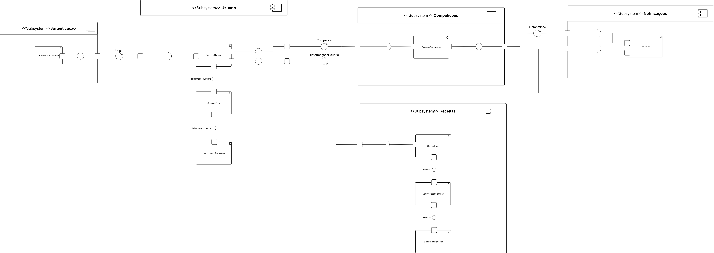

# Diagrama de Componentes

## Introdução

O diagrama de componentes é um artefato da UML que tem como objetivo representar a visão **estática** da arquitetura de um sistema, evidenciando a forma como este é dividido em partes modulares e reutilizáveis chamadas de **componentes**.  

Cada componente corresponde a uma parte independente do sistema que encapsula sua implementação interna e expõe interfaces bem definidas para se comunicar com outros componentes. Dessa forma, esse tipo de diagrama auxilia no entendimento da **arquitetura lógica** do sistema, servindo de ponte entre a modelagem conceitual e a implementação.  

Entre os principais elementos representados em um diagrama de componentes, destacam-se:

- **Componentes**: módulos independentes que oferecem e/ou requerem serviços.
- **Interfaces**: contratos que descrevem os serviços disponibilizados ou requeridos por um componente.
- **Dependências**: relações que demonstram como os componentes interagem ou dependem uns dos outros.
- **Artefatos**: representações físicas que podem ser geradas a partir de componentes, como bibliotecas, executáveis e pacotes.

## Objetivo

O objetivo da construção do diagrama de componentes neste projeto é fornecer uma visão clara da **arquitetura modular** do sistema em desenvolvimento. Isso permite:

- Melhor compreensão da estrutura de alto nível do sistema.
- Comunicação mais eficiente entre os membros da equipe.
- Apoio à tomada de decisões arquiteturais.
- Facilitação do planejamento da implementação e da manutenção futura.

## Diagrama de Componentes

### Diagrama de Componentes 1
 

<b>Autor(es):</b> 
<a href="https://github.com/Arturhk05" target="_blank">Artur Handow Krauspenhar</a> 

### Diagrama de Componentes 2
 

<b>Autor(es):</b> 
<a href="https://github.com/MylenaTrindade" target="_blank">Mylena Trindade Mendonça</a>

### Diagrama de Componentes 3
 

<b>Autor(es):</b> 
<a href="https://github.com/marcomarquesdc" target="_blank">Marco Marques</a>

---

## Referências Bibliográficas

> LARMAN, Craig. *Utilizando UML e Padrões*. 3. ed. Porto Alegre: Bookman, 2007.  

> SERRANO, Milene. Arquitetura e Desenho de Software: DSW-Modelagem - [Diagrama de Componentes](https://unbbr-my.sharepoint.com/personal/mileneserrano_unb_br/_layouts/15/stream.aspx?id=%2Fpersonal%2Fmileneserrano_unb_br%2FDocuments%2FArqDSW%20-%20VídeosOriginais%2F05h%20-%20VideoAula%20-%20DSW-Modelagem%20-%20Componentes%2Emp4&ga=1&referrer=StreamWebApp%2EWeb&referrerScenario=AddressBarCopied%2Eview%2Ee8e10b5a-4593-4a98-b10a-0570d88854dc)

---

## Histórico de Versão
| Data       | Versão | Descrição                                                                 | Autor                                                                                 | Revisores |
| ---------- | ------ | ------------------------------------------------------------------------- | ------------------------------------------------------------------------------------- | --------- |
| 20/09/2025 | `1.0`  | Criação inicial do documento e elaboração dos tópicos (introdução, objetivo, metodologia) | [Marco Marques](https://github.com/marcomarquesdc) |  Artur Krasupenhar  |
| 21/09/2025 | `2.0`  | Adiciona diagramas 1 e 2 | [Artur Krauspenhar](https://github.com/Arturhk05) |           |
| 21/09/2025 | `3.0`  | Adiciona diagrama 3      | [Marco Marques](https://github.com/marcomarquesdc)|           |
